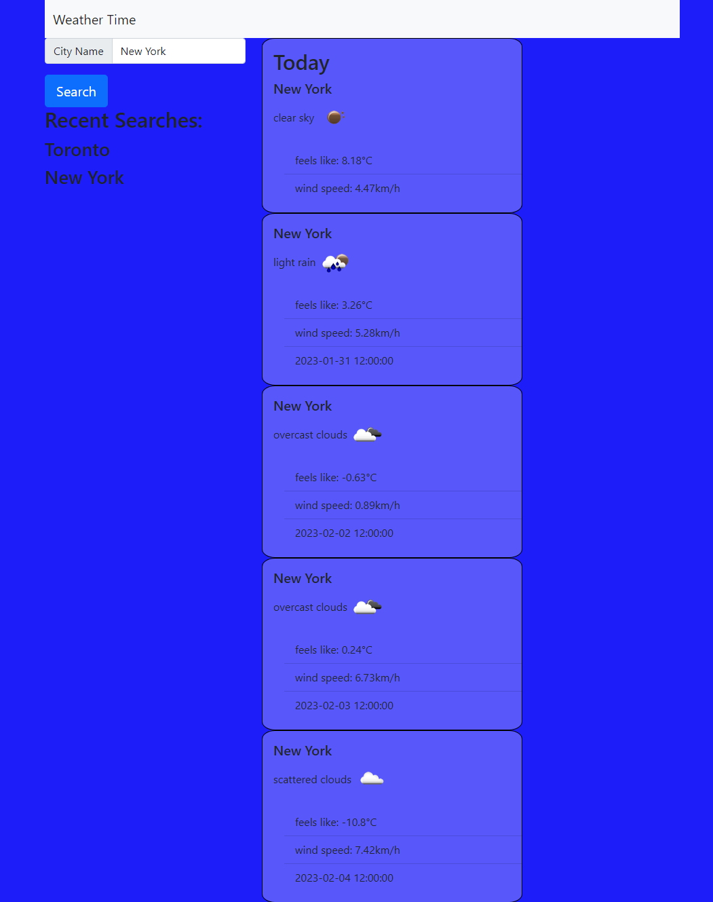

# Weather-Forecaster

## Description

I set out to piece together a web app that would on command display simple weather information with a user search. The application uses the openWeather Api call to display selected information on a location of the user's search. Through this development I learned quite a bit about how to not only use Api calls but to log and retrieve information from the return. This knowledge has further helped me become more dynamic in my ability to display data based on a wider set of conditions. 

## Table of Contents 

If your README is long, add a table of contents to make it easy for users to find what they need.

- [Installation](#installation)
- [Usage](#usage)
- [Credits](#credits)
- [License](#license)

## Installation

There are no needed steps to installation, simply open the web app and enter a desired city.

## Usage

Once the user opens the web App, they will see a search bar on the top left. Entering a city in the field will yield simple weather results for the current day, and then 5 days following it. The forecast results display temperature, conditions, wind speed and day and time of set data for future forecasts.

.
    
   

## Credits

Thanks to UToronto and openWeather Api for their service.

## License

MIT License

Copyright (c) 2023 TamasPinter

Permission is hereby granted, free of charge, to any person obtaining a copy
of this software and associated documentation files (the "Software"), to deal
in the Software without restriction, including without limitation the rights
to use, copy, modify, merge, publish, distribute, sublicense, and/or sell
copies of the Software, and to permit persons to whom the Software is
furnished to do so, subject to the following conditions:

The above copyright notice and this permission notice shall be included in all
copies or substantial portions of the Software.

THE SOFTWARE IS PROVIDED "AS IS", WITHOUT WARRANTY OF ANY KIND, EXPRESS OR
IMPLIED, INCLUDING BUT NOT LIMITED TO THE WARRANTIES OF MERCHANTABILITY,
FITNESS FOR A PARTICULAR PURPOSE AND NONINFRINGEMENT. IN NO EVENT SHALL THE
AUTHORS OR COPYRIGHT HOLDERS BE LIABLE FOR ANY CLAIM, DAMAGES OR OTHER
LIABILITY, WHETHER IN AN ACTION OF CONTRACT, TORT OR OTHERWISE, ARISING FROM,
OUT OF OR IN CONNECTION WITH THE SOFTWARE OR THE USE OR OTHER DEALINGS IN THE
SOFTWARE.